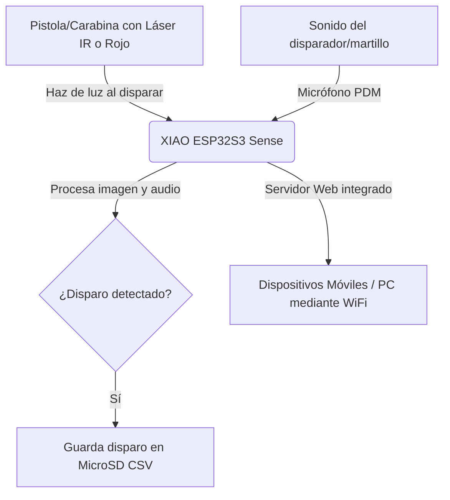

# Guía de Uso y Descripción del Sistema: Splatt DIY 🎯

**Splatt DIY** es un entrenador de tiro deportivo de nivel profesional y bajo costo basado en visión por computadora. Esta versión (v2.0) funciona de forma autónoma (standalone) directamente sobre el hardware **Seeed Studio XIAO ESP32S3 Sense**, sirviendo un panel de control interactivo mediante WiFi al que se puede acceder desde cualquier navegador web en smartphones, tablets o computadoras sin necesidad de instalar software en la PC.

---

## 📋 Tabla de Contenidos
1. [Descripción del Sistema](#descripción-del-sistema)
2. [Guía Rápida de Inicio (Quick Start)](#guía-rápida-de-inicio-quick-start)
3. [Guía de Uso Detallada](#guía-de-uso-detallada)
   - [Panel de Calibración](#1-calibración-del-punto-de-impacto)
   - [Gestión de Disparos](#2-ciclo-de-disparo-y-pantalla-hud)
   - [Panel de Ajustes Avanzados](#3-ajustes-de-sensibilidad-láser-y-audio)
   - [Historial de Sesiones y MicroSD](#4-historial-de-sesiones)
4. [Resolución de Problemas (FAQ)](#resolución-de-problemas-y-soluciones)

---

## Descripción del Sistema

El sistema se compone de dos partes fundamentales: el **Hardware Emisor/Sensor** y el **Software de Control en Web**.

### Componentes de Hardware Clave:
1. **Seeed Studio XIAO ESP32S3 Sense**: Microcontrolador compacto equipado con cámara OV3660 y micrófono PDM. Es el cerebro que realiza el procesamiento de imágenes en tiempo real a alta velocidad.
2. **Lente de Montura M12 (25mm)**: Permite ajustar el campo visual y el enfoque para apuntar con precisión a la diana desde la distancia de tiro (generalmente a 10 metros).
3. **Tarjeta MicroSD**: Almacena los resultados de cada sesión en formato de archivo de valores separados por comas (`.csv`) para su posterior análisis.
4. **Láser Emisor**: Instalado en el arma del usuario, emite un pulso corto al accionar el disparador.

---

## Guía Rápida de Inicio (Quick Start)

Ponga a funcionar su Splatt DIY en 5 sencillos pasos:

1. **Alimentación y Encendido**: Conecte el XIAO ESP32S3 Sense a una fuente de alimentación USB (cargador de móvil o batería externa). El dispositivo creará una red WiFi propia.
2. **Conexión de Red**: Busque redes WiFi en su teléfono, tablet o computadora y conéctese a:
   - **SSID**: `Splatt_Elite`
   - **Contraseña**: `splatt123`
3. **Acceso al Panel**: Abra su navegador web (Chrome, Safari, Firefox) y acceda a la dirección:
   - **URL**: [http://splatt.local](http://splatt.local) (o `http://192.168.4.1` si su dispositivo no soporta mDNS).
4. **Enfoque Físico**:
   - Vaya a **AJUSTES** en la parte inferior del panel.
   - Presione el botón verde **🔍 Ajustar Enfoque (Lente)**.
   - Gire físicamente la rosca de la lente de la cámara hasta que la imagen de la diana en la pantalla se vea completamente nítida. Presione **Finalizar Enfoque**.
5. **¡A Entrenar!**:
   - Presione **🎯 INICIAR TIRO**.
   - Apunte a la diana física y accione el disparador. El sistema detectará el sonido del disparo, capturará el punto láser y mostrará su puntuación en la pantalla al instante.

---

## Guía de Uso Detallada

### 1. Calibración del Punto de Impacto
Para asegurar que el impacto digital coincida exactamente con las miras de su arma, siga el procedimiento de calibración:

- **Calibración Manual con D-Pad**: Use las flechas virtuales del D-Pad (▲, ◀, ▶, ▼) o las teclas de dirección físicas de su teclado para desplazar la diana digital.
- **Calibración por Disparo**:
  1. Presione el botón **CALIBRAR** en el panel de control. El modo cambiará a *CALIBRANDO* en la esquina superior izquierda.
  2. Apunte exactamente al **centro físico** de la diana (el 10) y realice un disparo (o varios para hacer un promedio).
  3. Presione **FINALIZAR CALIBRACIÓN**. El sistema calculará el desfase matemático promedio y alineará el centro de forma automática.
  - *Nota*: La calibración se almacena en la memoria flash no volátil (NVS) del chip y se recordará la próxima vez que encienda el dispositivo.

### 2. Ciclo de Disparo y Pantalla HUD
- **Iniciar Tiro**: Al presionar **🎯 INICIAR TIRO**, el sistema inicia un temporizador que registra cuánto tiempo tarda en apuntar y disparar. También dibuja una traza (línea azul) en pantalla que muestra el movimiento oscilatorio previo al disparo.
- **Detección Automática**: Al accionar el disparador, el sonido activa la captura de la posición del láser. Se calcula la puntuación ISSF (hasta décimas de punto, p.ej. `10.9` en el centro exacto).
- **Indicadores del HUD**:
  - **Puntuación**: Se muestra en tamaño grande en el centro con colores dinámicos (Dorado para tiros excepcionales $\geq 10.0$, Verde $\geq 8.0$, Rojo para disparos fallidos).
  - **Historial de Disparos**: Aparecerán círculos numerados de color rojo sobre la diana virtual indicando la agrupación de los disparos.
  - **Zoom Visual**: Use los botones **Zoom + / -** (o las teclas `+` y `-` en PC) para ampliar la vista de la diana sin alterar la calibración física ni la escala.

### 3. Ajustes de Sensibilidad Láser y Audio
Accediendo al botón de **AJUSTES** podrá afinar el rendimiento del sistema según las condiciones ambientales:

- **Sensibilidad Láser (Nivel 1-10)**: Modifica el umbral de detección del haz de luz. Si hay luz ambiental muy fuerte y se registran falsos disparos, baje el nivel. Si el láser es muy tenue, incremente el nivel.
- **Exposición (Oscurecer fondo)**: Reduce el tiempo de exposición de la cámara (10 a 1200 ms) para que el fondo se vea oscuro y solo destaque el punto brillante del láser.
- **Ganancia de Sensibilidad (0-30)**: Amplificación digital de la imagen del sensor.
- **Distancia a la diana (Metros)** y **Lente de Cámara (mm)**: Parámetros necesarios para que el algoritmo matemático traduzca los píxeles de la cámara a milímetros reales del estándar ISSF 10m. Modifíquelos de acuerdo a su entorno físico (p.ej., lente de 25mm a 10 metros).
- **Sensibilidad de Sonido (Nivel 1-10)**: Ajusta la energía acústica necesaria para disparar la detección de la cámara (el clic metálico del percutor o el disparo). El primer pico de audio de inicialización se ignora automáticamente para evitar falsos positivos al encender el sistema.

### 4. Historial de Sesiones
Si el módulo cuenta con una tarjeta MicroSD integrada:
- Cada disparo se escribe automáticamente en un archivo de sesión `.csv` con la estructura: `Disparo, TiempoApuntado(ms), X, Y, Puntuacion`.
- Si el dispositivo se inicia sin tarjeta MicroSD, se mostrará la advertencia `⚠️ Sin MicroSD` en la pantalla HUD, aunque podrá seguir entrenando en tiempo real (los datos no se guardarán al apagar el dispositivo).
- Presione **📥 HISTORIAL** para ver el listado de todos los archivos guardados en la tarjeta MicroSD y descargarlos directamente a su dispositivo móvil o PC para abrirlos en aplicaciones como Excel.

---

## Resolución de Problemas y Soluciones

*   **El sistema no detecta el disparo al hacer clic con el arma:**
    *   *Solución:* Aumente el nivel de **Sensibilidad de Sonido** en el menú de Ajustes (un número mayor como 9 o 10 lo hace más sensible). Compruebe que el emisor de sonido esté lo suficientemente cerca del micrófono.
*   **Se registran disparos aleatorios sin accionar el arma:**
    *   *Solución:* Reduzca la **Sensibilidad de Sonido** o incremente el parámetro de **Exposición** para oscurecer la imagen y evitar que reflejos o bombillas se confundan con el láser.
*   **La imagen se ve borrosa en la ventana de enfoque:**
    *   *Solución:* Gire la lente M12 en sentido horario o antihorario de forma física hasta obtener el foco a la distancia correcta.
*   **No se guardan los archivos en la MicroSD:**
    *   *Solución:* Asegúrese de que la tarjeta esté formateada en FAT32 y esté insertada correctamente antes de alimentar el dispositivo.
