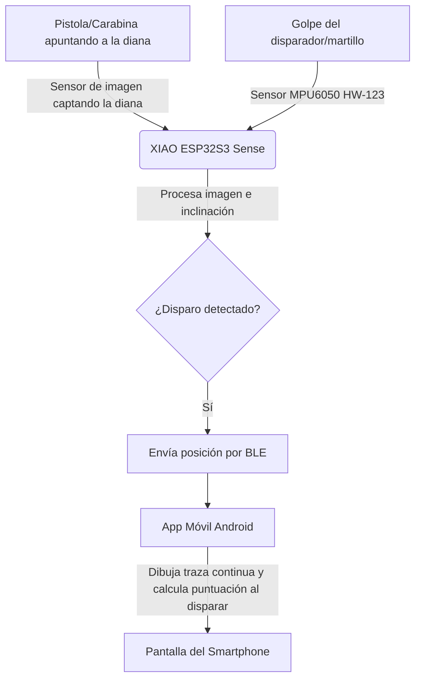

# Guía de Uso y Descripción del Sistema: Splatt Elite 🎯📱

**Splatt Elite** es un entrenador de tiro deportivo de nivel profesional y bajo costo basado en visión por computadora. Esta versión (v3.0) funciona mediante la combinación de un dispositivo de hardware compacto (**Seeed Studio XIAO ESP32S3 Sense**) y una aplicación móvil nativa para **Android** (desarrollada en Kotlin/Jetpack Compose), comunicándose de forma inalámbrica a través de **Bluetooth Low Energy (BLE)**.

Al delegar la interfaz visual y el guardado de datos a la aplicación móvil y utilizar BLE en lugar de WiFi, se ha optimizado drásticamente el consumo energético, extendiendo la autonomía de la batería de 400 mAh a **3 o 4 horas de uso continuo**.

---

## 📋 Tabla de Contenidos
1. [Descripción del Sistema](#descripción-del-sistema)
2. [Guía Rápida de Inicio (Quick Start)](#guía-rápida-de-inicio-quick-start)
3. [Guía de Uso Detallada](#guía-de-uso-detallada)
   - [Conexión y Vinculación BLE](#1-conexión-y-vinculación-ble)
   - [Calibración del Punto de Impacto](#2-calibración-del-punto-de-impacto)
   - [Ciclo Automático de Disparo (Inclinación)](#3-ciclo-automático-de-disparo-inclinación)
   - [Sesión de Entrenamiento y HUD](#4-sesión-de-entrenamiento-y-hud)
   - [Ajustes de Sensibilidad y Exposición](#5-ajustes-de-sensibilidad-y-exposición)
4. [Resolución de Problemas (FAQ)](#resolución-de-problemas-y-soluciones)

---

## Descripción del Sistema

El sistema se compone de dos componentes principales: el **Hardware Emisor/Sensor (ESP32)** y la **Aplicación Móvil Android**.

### Componentes de Hardware Clave:
1. **Seeed Studio XIAO ESP32S3 Sense**: El microcontrolador principal que procesa la imagen de la cámara a alta velocidad.
2. **Inclinómetro/Acelerómetro (MPU6050 / HW-123)**: Detecta automáticamente cuando levantas el arma para entrar en modo APUNTANDO, y capta físicamente la vibración mecánica exacta del gatillo para registrar el disparo (cero falsos positivos por ruido ambiental).
3. **Lente de Montura M12 (25mm)**: Permite ajustar el enfoque y conseguir el zoom necesario para capturar la diana a la distancia estándar de tiro (generalmente 10 metros).
4. **Batería LiPo (400mAh - 500mAh)**: Alimenta el hardware de forma portátil e inalámbrica.

---

## Guía Rápida de Inicio (Quick Start)

1. **Encendido**: Enciende el dispositivo Splatt Elite mediante su interruptor físico. El LED comenzará a indicar que está listo para emparejarse.
2. **Abrir la Aplicación**: Inicia la aplicación **Splatt Elite** en tu dispositivo Android. Asegúrate de tener el Bluetooth y la ubicación activados.
3. **Conexión Automática**: ¡No tienes que emparejar ni seleccionar nada manualmente! La aplicación escaneará y se conectará de forma totalmente automática al dispositivo **Splatt_Elite** en cuanto lo detecte en tu entorno.
4. **¡A Entrenar!**: Coloca la cámara del dispositivo apuntando a la diana física a 10 metros y monta el conjunto en tu arma. La app estará en modo **STANDBY**. Al levantar el arma horizontalmente, pasará automáticamente al modo **APUNTANDO** y registrará el disparo en cuanto detecte el golpe de tu gatillo. La app mostrará tu puntuación e historial de disparos al instante.

---

## Guía de Uso Detallada

### 1. Conexión y Vinculación BLE
La comunicación utiliza Bluetooth Low Energy para ahorrar batería.
- La placa se anuncia bajo el nombre `Splatt_Elite`.
- La aplicación se encarga de escanear y conectarse automáticamente en segundo plano (siempre que el Bluetooth esté encendido y con permisos de Dispositivos Cercanos).
- Una vez conectado, la aplicación recibirá notificaciones continuas en formato JSON con la telemetría del sensor (coordenadas `x`, `y` en tiempo real de la traza de la diana, duración del apuntado y la confirmación cuando haya detonación sonora).

### 2. Calibración del Punto de Impacto
Para asegurar que tus disparos virtuales se correspondan exactamente con tus miras físicas:
- **Calibración Manual**: Utiliza el D-Pad de la aplicación para mover las coordenadas del centro de la diana digital hacia arriba, abajo, izquierda o derecha de forma visual basándote en dónde caen los impactos.
- **Calibración por Disparos Múltiples**: Presiona el botón "CALIBRAR". Realiza tantos disparos como necesites apuntando rigurosamente al centro de la diana física. Verás aparecer impactos de color verde indicando dónde se registraron. Cuando termines, presiona "DETENER". La app calculará matemáticamente el **promedio de tus disparos** y ajustará el centro automáticamente.

### 3. Ciclo Automático de Disparo (Inclinación)
El sistema gestiona de forma inteligente los estados de entrenamiento usando el sensor de inclinación (MPU6050) del hardware para ahorrar batería y hacer la experiencia más natural, sin necesidad de tocar la pantalla de tu móvil para cada disparo:
- **Modo Reposo (STANDBY)**: Cuando el arma está apoyada o apuntando hacia abajo, la aplicación muestra el mensaje "Levanta el arma para apuntar". En este estado, el procesador de imagen del hardware se apaga temporalmente, ahorrando una enorme cantidad de batería.
- **Modo Apuntando (AIMING)**: En cuanto levantas el arma y la colocas en posición horizontal de tiro, el sensor detecta la inclinación y activa instantáneamente el seguimiento de la diana. La app comienza a dibujar la traza y queda alerta esperando la caída del disparador.
- **Post-Disparo**: Al accionar el gatillo, el sensor capta la vibración mecánica, registra el punto exacto de impacto y mantiene la traza visible durante unos segundos para que analices tu seguimiento ("follow-through"). Al volver a bajar el arma, el sistema entra en Reposo, manteniendo la traza visible en pantalla; esta solo se limpia cuando vuelves a levantar el arma para iniciar el próximo disparo.

### 4. Sesión de Entrenamiento y HUD
- **Traza de Apuntado (Colores)**: La aplicación dibuja una traza que muestra el movimiento del arma antes y después del disparo. Al realizar el disparo, la traza se colorea hacia atrás en el tiempo: **Verde** hasta 1 segundo antes del disparo, **Amarillo** desde 1 segundo hasta 0.2 segundos antes, **Azul** en los últimos 0.2 segundos antes de que rompa el tiro, y **Rojo** para el seguimiento post-disparo (follow-through). Durante la fase de apuntado, la línea se dibuja de color verde por defecto.
- **Puntuación ISSF**: El sistema calcula la puntuación en base a las coordenadas exactas de impacto, con precisión decimal (p.ej., `10.9` para un centro perfecto).
- **Lectura por Voz (TTS)**: Tras registrar un impacto, la aplicación utiliza el motor de voz del dispositivo para dictar en voz alta la puntuación obtenida y el porcentaje de parada, lo que te permite mantener la concentración y la postura de tiro sin tener que mirar la pantalla constantemente.
- **Parada (Hold Analysis)**: Inmediatamente debajo de la puntuación principal de la interfaz, se muestra en tiempo real el porcentaje de tiempo que fuiste capaz de mantener las miras dentro de la zona de diez puntos durante el último segundo antes del disparo.
- **Estadísticas en Vivo**: Pulsando el botón **📊 Stats** accederás a un resumen detallado de la sesión actual, que incluye la puntuación media, mejor disparo, porcentaje de dieces, parada media, y parámetros fundamentales para la corrección de miras como el **Centroide** (la tendencia en milímetros hacia donde se desvían tus disparos) y el **Diámetro de Agrupación**.
- **Guardado y Sesiones (CSV)**: Todos los datos (número de disparo, coordenadas raw, puntuación y **porcentajes de parada**) de la sesión se almacenan en la app y pueden exportarse a un archivo **.csv** universal usando el botón **📥 CSV** para analizarlos gráficamente en tu ordenador.

### 5. Ajustes del Sistema y Utilidad de los Controles

Para acceder a este menú, presiona el botón **Ajustes** en la parte inferior derecha de la pantalla principal (debe estar conectado el dispositivo por BLE). Estos controles te permiten adaptar el entrenador a las condiciones de iluminación de tu habitación, la acústica de tu arma de entrenamiento y las dimensiones físicas de tu galería de tiro.

A continuación se detalla el funcionamiento de cada control, sus rangos de valores y su utilidad práctica:

#### 1. Sensibilidad a la Diana (Oscuridad) (Nivel: 1 - 10)
*   **¿Qué hace?**: Controla el umbral de detección (`detect_threshold` o `thr` en el firmware) para identificar el color negro de la diana.
    *   *Fórmula interna:* Se envía el comando BLE `thr:${sensibilidad * 20}`.
    *   **Nivel 10 (Más sensible)**: Envía un umbral muy alto (`thr:200`), detectando dianas incluso si están muy iluminadas (gris claro) o en condiciones de luz intensa como galerías ISSF.
    *   **Nivel 1 (Menos sensible)**: Envía un umbral bajo (`thr:20`), requiriendo que la diana sea de un negro muy intenso/puro para ser detectada.
*   **Utilidad práctica**: 
    *   Si experimentas "saltos en la traza" debido a sombras muy oscuras en el fondo de la habitación o muebles oscuros, **reduce la sensibilidad** (p.ej., a nivel 3 o 4) para que la cámara solo siga a la diana negra.
    *   Si la traza se corta o desaparece al mover el arma porque la diana no resalta lo suficiente, **aumenta la sensibilidad** (p.ej., a nivel 8 o 9).

#### 2. Exposición (Control de Luz) (Rango: 10 - 1200 ms)
*   **¿Qué hace?**: Ajusta el tiempo de exposición del sensor de la cámara (`exp` en el firmware).
*   **Utilidad práctica**:
    *   **Controlar la luz de la imagen** es clave para que el algoritmo aísle la diana oscura. Un valor ajustado correctamente hará que la diana resalte frente al fondo de la pared.
    *   Si entrenas en una habitación muy iluminada, **reduce la exposición** (p.ej., a 100-200 ms) para que la imagen no se queme (sobreexposición) y el negro de la diana sea fácilmente visible.
    *   Si estás en un ambiente oscuro y la diana apenas se distingue de la pared, **aumenta la exposición** (p.ej., a 400-600 ms). *Nota: Exposiciones demasiado altas pueden limitar los frames por segundo (FPS) de la captura.*

#### 3. Ganancia Sensibilidad (Rango: 0 - 30)
*   **¿Qué hace?**: Controla la amplificación de la señal del sensor de imagen (`gain` en el firmware).
*   **Utilidad práctica**:
    *   Permite amplificar la imagen general mediante software sin aumentar el tiempo de exposición.
    *   Si la iluminación es pobre pero necesitas mantener la exposición baja para capturar a altos FPS (evitando el desenfoque de movimiento), sube la ganancia a un valor moderado (p.ej., 5 a 15).
    *   *Recomendación:* Intenta mantenerla en `0` o lo más baja posible para evitar ruido digital (grano en la imagen), el cual puede generar vibración o inestabilidad en la traza.

#### 4. Distancia a la diana (Metros) (Rango: 1.0m - 25.0m)
*   **¿Qué hace?**: Ajusta el parámetro de distancia física entre la boca del cañón/cámara y la diana de papel (ajuste puramente local en la App Android).
*   **Utilidad práctica**:
    *   Es fundamental para calcular correctamente la puntuación ISSF (desde 0.0 hasta 10.9). Al cambiar la distancia, la aplicación realiza un escalado matemático que adapta la escala milimétrica de los anillos olímpicos a la perspectiva física captada por la cámara.
    *   *Fórmula de escala:* `scaleFactor = (distancia_metros * 1000) / (lente_mm / 0.0022)`.
    *   Debes configurar este control con la distancia exacta medida con cinta métrica en tu lugar de entrenamiento para garantizar puntuaciones 100% realistas y comparables con una galería de tiro real.

#### 5. Sensibilidad de Impacto (Nivel: 1 - 10)
*   **¿Qué hace?**: Controla la fuerza del impacto mecánico necesaria en el MPU6050 para registrar un disparo (umbral de movimiento).
    *   **Nivel 10 (Más sensible)**: Requiere un golpe muy débil para registrar el disparo (umbral bajo).
    *   **Nivel 1 (Menos sensible)**: Requiere un golpe seco y fuerte para registrar el disparo (umbral alto).
*   **Utilidad práctica**:
    *   Ajusta este parámetro para que el sistema capture perfectamente la caída de la aguja percutora o el "clic" del disparador de tu arma en tiro en seco.
    *   Si el sistema detecta "disparos" simplemente por mover el arma bruscamente o al cerrarla, reduce el valor (p.ej., nivel 3 a 5) para exigir un golpe más nítido.

---

## Resolución de Problemas y Soluciones

*   **La App no se conecta al dispositivo:**
    *   *Solución:* Asegúrate de que el Bluetooth del móvil está encendido y que has concedido los permisos de "Dispositivos cercanos" y "Ubicación" (necesarios en Android para escanear BLE). Reinicia el dispositivo Splatt Elite e inténtalo de nuevo.
*   **El golpe del disparador no activa la captura:**
    *   *Solución:* Aumenta el valor de la "Sensibilidad de Impacto" en los ajustes. Asegúrate de que el módulo MPU6050 (HW-123) esté fijado o pegado firmemente al arma sin holguras.
*   **Se registran disparos falsos al mover el arma:**
    *   *Solución:* Disminuye el valor de la "Sensibilidad de Impacto" para exigir un golpe más fuerte (el clic del disparador).
*   **No se detecta la diana o la traza no se dibuja:**
    *   *Solución:* Asegúrate de que la cámara apunta directamente a la diana y no está desenfocada. Si estás en una galería muy iluminada (tipo ISSF), la diana negra puede reflejar mucha luz y parecer gris para la cámara. **Sube el valor de "Sensibilidad a la Diana" (nivel 8 a 10)** para que la cámara la detecte, o reduce el tiempo de exposición para oscurecer la imagen general.
*   **La batería se agota muy rápido o carga lento:**
    *   *Solución:* Activa el modo de **Bajo Consumo / Sleep** desde la app al terminar de entrenar o durante la carga. Esto pone al chip ESP32 en Deep Sleep profundo, cortando casi por completo el consumo de corriente.
