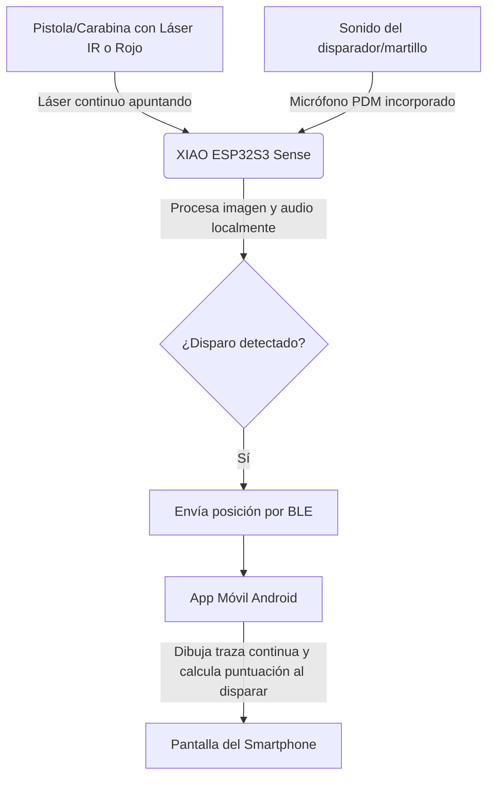

# Guía de Uso y Descripción del Sistema: Splatt Elite 🎯📱

**Splatt Elite** es un entrenador de tiro deportivo de nivel profesional y bajo costo basado en visión por computadora. Esta versión (v3.0) funciona mediante la combinación de un dispositivo de hardware compacto (**Seeed Studio XIAO ESP32S3 Sense**) y una aplicación móvil nativa para **Android** (desarrollada en Kotlin/Jetpack Compose), comunicándose de forma inalámbrica a través de **Bluetooth Low Energy (BLE)**.

Al delegar la interfaz visual y el guardado de datos a la aplicación móvil y utilizar BLE en lugar de WiFi, se ha optimizado drásticamente el consumo energético, extendiendo la autonomía de la batería de 400 mAh a **3 o 4 horas de uso continuo**.

---

## 📋 Tabla de Contenidos
1. [Descripción del Sistema](#descripción-del-sistema)
2. [Guía Rápida de Inicio (Quick Start)](#guía-rápida-de-inicio-quick-start)
3. [Guía de Uso Detallada](#guía-de-uso-detallada)
   - [Conexión y Vinculación BLE](#1-conexión-y-vinculación-ble)
   - [Asistente de Enfoque Óptico](#2-asistente-de-enfoque-óptico)
   - [Calibración del Punto de Impacto](#3-calibración-del-punto-de-impacto)
   - [Sesión de Entrenamiento y HUD](#4-sesión-de-entrenamiento-y-hud)
   - [Ajustes de Sensibilidad y Exposición](#5-ajustes-de-sensibilidad-y-exposición)
4. [Resolución de Problemas (FAQ)](#resolución-de-problemas-y-soluciones)

---

## Descripción del Sistema

El sistema se compone de dos componentes principales: el **Hardware Emisor/Sensor (ESP32)** y la **Aplicación Móvil Android**.

### Componentes de Hardware Clave:
1. **Seeed Studio XIAO ESP32S3 Sense**: El microcontrolador principal que procesa la imagen de la cámara y el audio del micrófono a alta velocidad.
2. **Lente de Montura M12 (25mm)**: Permite ajustar el enfoque y conseguir el zoom necesario para capturar la diana a la distancia estándar de tiro (generalmente 10 metros).
3. **Módulo Láser**: Montado en el arma, debe estar encendido de forma continua mientras se apunta. La cámara sigue este punto constantemente para dibujar la traza, y registrará el impacto en el momento exacto en que el micrófono detecte el sonido del disparo.
4. **Batería LiPo (400mAh - 500mAh)**: Alimenta el hardware de forma portátil e inalámbrica.

---

## Guía Rápida de Inicio (Quick Start)

1. **Encendido**: Enciende el dispositivo Splatt Elite mediante su interruptor físico. El LED comenzará a indicar que está listo para emparejarse.
2. **Abrir la Aplicación**: Inicia la aplicación **Splatt Elite** en tu dispositivo Android. Asegúrate de tener el Bluetooth y la ubicación activados.
3. **Conexión Automática**: ¡No tienes que emparejar ni seleccionar nada manualmente! La aplicación escaneará y se conectará de forma totalmente automática al dispositivo **Splatt_Elite** en cuanto lo detecte en tu entorno.
4. **Enfoque de la Cámara**:
   - En la aplicación, activa el **Asistente de Enfoque**.
   - Gira suavemente la lente M12 del dispositivo de forma física mientras observas el medidor de nitidez en la app.
   - El objetivo es ajustar la lente hasta que el valor de nitidez alcance su punto más alto (máximo local). Una vez enfocado, desactiva el asistente.
5. **¡A Entrenar!**: Coloca el dispositivo apuntando a la diana física a 10 metros, monta el láser en tu arma y comienza a disparar. La app mostrará tu puntuación e historial de disparos al instante.

---

## Guía de Uso Detallada

### 1. Conexión y Vinculación BLE
La comunicación utiliza Bluetooth Low Energy para ahorrar batería.
- La placa se anuncia bajo el nombre `Splatt_Elite`.
- La aplicación se encarga de escanear y conectarse automáticamente en segundo plano (siempre que el Bluetooth esté encendido y con permisos de Dispositivos Cercanos).
- Una vez conectado, la aplicación recibirá notificaciones continuas en formato JSON con la telemetría del sensor (coordenadas `x`, `y` en tiempo real de la traza del láser continuo, duración del apuntado y la confirmación cuando haya detonación sonora).

### 2. Asistente de Enfoque Óptico
Dado que el dispositivo no transmite un flujo de video continuo para ahorrar batería y ancho de banda, cuenta con un algoritmo de enfoque óptico autónomo:
- Al presionar **Iniciar Enfoque** en la app, el ESP32 evalúa la nitidez de los bordes usando una variación rápida de gradiente (Laplaciano).
- Envía un número entero que representa el nivel de enfoque en tiempo real.
- Simplemente gira la rosca de la lente M12 hacia la izquierda o derecha. Verás cómo sube o baja el valor. Déjala fija en la posición que dé el valor máximo.

### 3. Calibración del Punto de Impacto
Para asegurar que tus disparos virtuales se correspondan exactamente con tus miras físicas:
- **Calibración Manual**: Utiliza el D-Pad de la aplicación para mover las coordenadas del centro de la diana digital hacia arriba, abajo, izquierda o derecha de forma visual basándote en dónde caen los impactos.
- **Calibración por Disparos Múltiples**: Presiona el botón "CALIBRAR". Realiza tantos disparos como necesites apuntando rigurosamente al centro de la diana física. Verás aparecer impactos de color verde indicando dónde se registraron. Cuando termines, presiona "DETENER". La app calculará matemáticamente el **promedio de tus disparos** y ajustará el láser al centro automáticamente.

### 4. Sesión de Entrenamiento y HUD
- **Traza de Apuntado (Colores)**: La aplicación dibuja una traza que muestra el movimiento del arma. El color de la línea cambia según el tiempo que lleves apuntando: Verde (hasta 4s), Naranja (hasta 8s), Azul Oscuro (hasta 12s) y Rojo (más de 12s), ayudando a visualizar la fatiga o exceso de tiempo.
- **Puntuación ISSF**: El sistema calcula la puntuación en base a las coordenadas exactas de impacto, con precisión decimal (p.ej., `10.9` para un centro perfecto).
- **Guardado y Sesiones (CSV)**: Todos los datos (número de disparo, coordenadas raw y puntuación) de la sesión se almacenan en la app y pueden exportarse a un archivo **.csv** universal usando el botón **📥 Exportar CSV**.

### 5. Ajustes de Sensibilidad, Distancia y Exposición
A través del menú de configuración en la app, puedes ajustar los parámetros en tiempo real:
- **Distancia a la diana y Lente**: Puedes ajustar de forma variable (mediante deslizadores) la distancia física a la diana (1 a 25 metros) y la distancia focal de tu lente (ej. 25mm). La aplicación escalará matemáticamente el tamaño de la diana para mantener una medición ISSF perfecta sin importar dónde te coloques.
- **Sensibilidad del Láser (detect_threshold)**: Umbral mínimo de brillo para que un punto sea considerado láser. Auméntalo si hay reflejos del sol o luces de la habitación que causen falsas detecciones.
- **Exposición de la Cámara (cam_exposure)**: Tiempo de exposición del sensor (en ms). Un valor bajo oscurece la imagen de fondo de modo que solo el punto brillante del láser sea visible.
- **Sensibilidad de Sonido (audio_threshold)**: Nivel *mínimo* de volumen para activar el disparo.
- **Rechazo de Ruido Fuerte (max_snd)**: Nivel *máximo* de ruido permitido. Cualquier ruido que supere este nivel será ignorado. Esto sirve para que la aplicación no se dispare al cerrar una puerta, dar una palmada o hablar fuerte, garantizando que solo captura el clic mecánico de tu arma. Ponlo al "10" si quieres desactivarlo.

---

## Resolución de Problemas y Soluciones

*   **La App no se conecta al dispositivo:**
    *   *Solución:* Asegúrate de que el Bluetooth del móvil está encendido y que has concedido los permisos de "Dispositivos cercanos" y "Ubicación" (necesarios en Android para escanear BLE). Reinicia el dispositivo Splatt Elite e inténtalo de nuevo.
*   **El sonido del disparo no activa la captura:**
    *   *Solución:* Disminuye el valor de `audio_threshold` en los ajustes (un umbral más bajo requiere menos volumen para dispararse). Asegúrate de que el micrófono de la placa apunte hacia el arma.
*   **Se registran disparos falsos debido al ruido ambiental:**
    *   *Solución:* Incrementa el valor de `audio_threshold` para exigir un sonido más fuerte y metálico (el clic del disparador).
*   **No se detecta el punto del láser:**
    *   *Solución:* Asegúrate de que el láser está alineado y pasa por el campo visual de la cámara. Si el láser es de baja potencia, reduce el valor de `detect_threshold` o aumenta el tiempo de exposición (`cam_exposure`).
*   **La batería se agota muy rápido o carga lento:**
    *   *Solución:* Activa el modo de **Bajo Consumo / Sleep** desde la app al terminar de entrenar o durante la carga. Esto pone al chip ESP32 en Deep Sleep profundo, cortando casi por completo el consumo de corriente.
