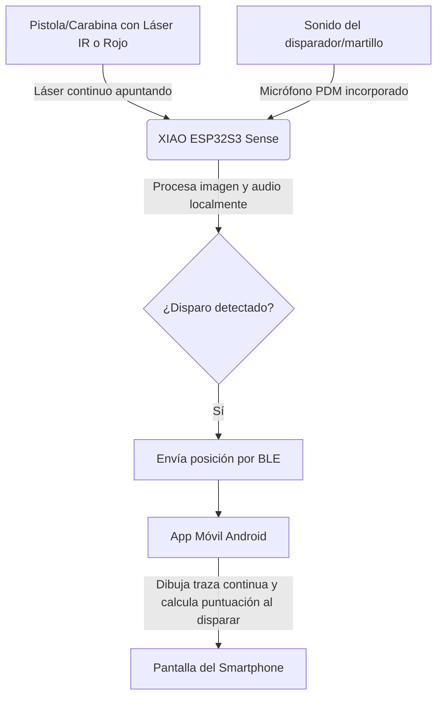

# Guía de Uso y Descripción del Sistema: Splatt Elite 🎯📱

**Splatt Elite** es un entrenador de tiro deportivo de nivel profesional y bajo costo basado en visión por computadora. Esta versión (v3.0) funciona mediante la combinación de un dispositivo de hardware compacto (**Seeed Studio XIAO ESP32S3 Sense**) y una aplicación móvil nativa para **Android** (desarrollada en Kotlin/Jetpack Compose), comunicándose de forma inalámbrica a través de **Bluetooth Low Energy (BLE)**.

Al delegar la interfaz visual y el guardado de datos a la aplicación móvil y utilizar BLE en lugar de WiFi, se ha optimizado drásticamente el consumo energético, extendiendo la autonomía de la batería de 400 mAh a **3 o 4 horas de uso continuo**.

---

## 📋 Tabla de Contenidos
1. [Descripción del Sistema](#descripción-del-sistema)
2. [Guía Rápida de Inicio (Quick Start)](#guía-rápida-de-inicio-quick-start)
3. [Guía de Uso Detallada](#guía-de-uso-detallada)
   - [Conexión y Vinculación BLE](#1-conexión-y-vinculación-ble)
   - [Asistente de Enfoque Óptico](#2-asistente-de-enfoque-óptico)
   - [Calibración del Punto de Impacto](#3-calibración-del-punto-de-impacto)
   - [Sesión de Entrenamiento y HUD](#4-sesión-de-entrenamiento-y-hud)
   - [Ajustes de Sensibilidad y Exposición](#5-ajustes-de-sensibilidad-y-exposición)
4. [Resolución de Problemas (FAQ)](#resolución-de-problemas-y-soluciones)

---

## Descripción del Sistema

El sistema se compone de dos componentes principales: el **Hardware Emisor/Sensor (ESP32)** y la **Aplicación Móvil Android**.

### Componentes de Hardware Clave:
1. **Seeed Studio XIAO ESP32S3 Sense**: El microcontrolador principal que procesa la imagen de la cámara y el audio del micrófono a alta velocidad.
2. **Lente de Montura M12 (25mm)**: Permite ajustar el enfoque y conseguir el zoom necesario para capturar la diana a la distancia estándar de tiro (generalmente 10 metros).
3. **Módulo Láser**: Montado en el arma, debe estar encendido de forma continua mientras se apunta. La cámara sigue este punto constantemente para dibujar la traza, y registrará el impacto en el momento exacto en que el micrófono detecte el sonido del disparo.
4. **Batería LiPo (400mAh - 500mAh)**: Alimenta el hardware de forma portátil e inalámbrica.

---

## Guía Rápida de Inicio (Quick Start)

1. **Encendido**: Enciende el dispositivo Splatt Elite mediante su interruptor físico. El LED comenzará a indicar que está listo para emparejarse.
2. **Abrir la Aplicación**: Inicia la aplicación **Splatt Elite** en tu dispositivo Android. Asegúrate de tener el Bluetooth y la ubicación activados.
3. **Conexión Automática**: ¡No tienes que emparejar ni seleccionar nada manualmente! La aplicación escaneará y se conectará de forma totalmente automática al dispositivo **Splatt_Elite** en cuanto lo detecte en tu entorno.
4. **Enfoque de la Cámara**:
   - En la aplicación, activa el **Asistente de Enfoque**.
   - Gira suavemente la lente M12 del dispositivo de forma física mientras observas el medidor de nitidez en la app.
   - El objetivo es ajustar la lente hasta que el valor de nitidez alcance su punto más alto (máximo local). Una vez enfocado, desactiva el asistente.
5. **¡A Entrenar!**: Coloca el dispositivo apuntando a la diana física a 10 metros, monta el láser en tu arma y comienza a disparar. La app mostrará tu puntuación e historial de disparos al instante.

---

## Guía de Uso Detallada

### 1. Conexión y Vinculación BLE
La comunicación utiliza Bluetooth Low Energy para ahorrar batería.
- La placa se anuncia bajo el nombre `Splatt_Elite`.
- La aplicación se encarga de escanear y conectarse automáticamente en segundo plano (siempre que el Bluetooth esté encendido y con permisos de Dispositivos Cercanos).
- Una vez conectado, la aplicación recibirá notificaciones continuas en formato JSON con la telemetría del sensor (coordenadas `x`, `y` en tiempo real de la traza del láser continuo, duración del apuntado y la confirmación cuando haya detonación sonora).

### 2. Asistente de Enfoque Óptico
Dado que el dispositivo no transmite un flujo de video continuo para ahorrar batería y ancho de banda, cuenta con un algoritmo de enfoque óptico autónomo:
- Al presionar **Iniciar Enfoque** en la app, el ESP32 evalúa la nitidez de los bordes usando una variación rápida de gradiente (Laplaciano).
- Envía un número entero que representa el nivel de enfoque en tiempo real.
- Simplemente gira la rosca de la lente M12 hacia la izquierda o derecha. Verás cómo sube o baja el valor. Déjala fija en la posición que dé el valor máximo.

### 3. Calibración del Punto de Impacto
Para asegurar que tus disparos virtuales se correspondan exactamente con tus miras físicas:
- **Calibración Manual**: Utiliza el D-Pad de la aplicación para mover las coordenadas del centro de la diana digital hacia arriba, abajo, izquierda o derecha de forma visual basándote en dónde caen los impactos.
- **Calibración por Disparos Múltiples**: Presiona el botón "CALIBRAR". Realiza tantos disparos como necesites apuntando rigurosamente al centro de la diana física. Verás aparecer impactos de color verde indicando dónde se registraron. Cuando termines, presiona "DETENER". La app calculará matemáticamente el **promedio de tus disparos** y ajustará el láser al centro automáticamente.

### 4. Sesión de Entrenamiento y HUD
- **Traza de Apuntado (Colores)**: La aplicación dibuja una traza que muestra el movimiento del arma. El color de la línea cambia según el tiempo que lleves apuntando: Verde (hasta 4s), Naranja (hasta 8s), Azul Oscuro (hasta 12s) y Rojo (más de 12s), ayudando a visualizar la fatiga o exceso de tiempo.
- **Puntuación ISSF**: El sistema calcula la puntuación en base a las coordenadas exactas de impacto, con precisión decimal (p.ej., `10.9` para un centro perfecto).
- **Guardado y Sesiones (CSV)**: Todos los datos (número de disparo, coordenadas raw y puntuación) de la sesión se almacenan en la app y pueden exportarse a un archivo **.csv** universal usando el botón **📥 Exportar CSV**.

### 5. Ajustes del Sistema y Utilidad de los Controles

Para acceder a este menú, presiona el botón **Ajustes** en la parte inferior derecha de la pantalla principal (debe estar conectado el dispositivo por BLE). Estos controles te permiten adaptar el entrenador a las condiciones de iluminación de tu habitación, la acústica de tu arma de entrenamiento y las dimensiones físicas de tu galería de tiro.

A continuación se detalla el funcionamiento de cada control, sus rangos de valores y su utilidad práctica:

#### 1. Sensibilidad Láser (Nivel: 1 - 10)
*   **¿Qué hace?**: Controla el umbral de detección (`detect_threshold` o `thr` en el firmware) para el punto del láser.
    *   *Fórmula interna:* Se envía el comando BLE `thr:${(11 - sensibilidad) * 5}`.
    *   **Nivel 10 (Más sensible)**: Envía un umbral muy bajo (`thr:5`), detectando láseres poco intensos o de baterías gastadas.
    *   **Nivel 1 (Menos sensible)**: Envía un umbral alto (`thr:50`), requiriendo un láser extremadamente brillante para ser detectado.
*   **Utilidad práctica**: 
    *   Si experimentas "falsos disparos" o "trazas fantasma" debido a reflejos de luz solar, focos de luz en la habitación o superficies brillantes, **reduce la sensibilidad** (p.ej., a nivel 3 o 4).
    *   Si la traza del láser se corta o desaparece al mover rápidamente el arma, **aumenta la sensibilidad** (p.ej., a nivel 8 o 9).

#### 2. Exposición (Oscurecer fondo) (Rango: 10 - 1200 ms)
*   **¿Qué hace?**: Ajusta el tiempo de exposición del sensor de la cámara (`exp` en el firmware).
*   **Utilidad práctica**:
    *   **Oscurecer la imagen de fondo** es clave para que el algoritmo del ESP32 aísle el láser. Un valor de exposición bajo (como 150-300 ms) hará que todo el fondo se vea negro y solo resalte el punto luminoso del láser.
    *   Si juegas en una habitación muy iluminada o frente a una ventana, **reduce la exposición** (p.ej., a 100-200 ms) para eliminar el ruido ambiental.
    *   Si estás en un ambiente oscuro y el láser apenas es visible para el sensor, **aumenta la exposición** (p.ej., a 400-600 ms). *Nota: Exposiciones demasiado altas pueden limitar los frames por segundo (FPS) de la captura.*

#### 3. Ganancia Sensibilidad (Rango: 0 - 30)
*   **¿Qué hace?**: Controla la amplificación de la señal del sensor de imagen (`gain` en el firmware).
*   **Utilidad práctica**:
    *   Permite amplificar el brillo del láser mediante software en el sensor sin aumentar el tiempo de exposición.
    *   Si tu láser IR es débil pero necesitas mantener la exposición baja para capturar a altos FPS, sube la ganancia a un valor moderado (p.ej., 5 a 15).
    *   *Recomendación:* Intenta mantenerla en `0` o lo más baja posible para evitar ruido digital (grano en la imagen), el cual puede generar vibración o inestabilidad en la traza.

#### 4. Distancia a la diana (Metros) (Rango: 1.0m - 25.0m)
*   **¿Qué hace?**: Ajusta el parámetro de distancia física entre la boca del cañón/cámara y la diana de papel (ajuste puramente local en la App Android).
*   **Utilidad práctica**:
    *   Es fundamental para calcular correctamente la puntuación ISSF (desde 0.0 hasta 10.9). Al cambiar la distancia, la aplicación realiza un escalado matemático que adapta la escala milimétrica de los anillos olímpicos a la perspectiva física captada por la cámara.
    *   *Fórmula de escala:* `scaleFactor = (distancia_metros * 1000) / (lente_mm / 0.0022)`.
    *   Debes configurar este control con la distancia exacta medida con cinta métrica en tu lugar de entrenamiento para garantizar puntuaciones 100% realistas y comparables con una galería de tiro real.

#### 5. Lente de Cámara (mm) (Rango: 1.0mm - 50.0mm)
*   **¿Qué hace?**: Configura la distancia focal de la lente física M12 que tienes enroscada en el ESP32 Sense (ajuste local en la App Android). La lente predeterminada suele ser de **25.0 mm** (ofrece un zoom óptico excelente para disparar a 10 metros).
*   **Utilidad práctica**:
    *   Junto con el control de distancia, le dice a la app cuánto zoom óptico tiene la imagen. Si cambias de lente (por ejemplo, a una de 12mm o 16mm para espacios más reducidos), debes ajustar este valor aquí para no alterar los cálculos de puntuación.

#### 6. Sensibilidad de Sonido (Nivel: 1 - 10)
*   **¿Qué hace?**: Controla el nivel de volumen mínimo del micrófono PDM integrado en la placa necesario para registrar un disparo (`snd` en el firmware).
    *   *Fórmula interna:* Se envía el comando BLE `snd:${nivel * 250}`.
    *   **Nivel 1 (Más sensible)**: Requiere muy poca energía acústica (`snd:250`) para detonar.
    *   **Nivel 10 (Menos sensible)**: Requiere un golpe fuerte (`snd:2500`) para registrar el disparo.
*   **Utilidad práctica**:
    *   Ajusta este parámetro para que la aplicación capture el sonido de la aguja percutora o el "clic" metálico del disparador al realizar tiro en seco (dry-fire).
    *   Si usas carabina de aire comprimido o el mecanismo de tu arma es muy ruidoso, selecciona un valor más alto (p.ej., nivel 7 a 9) para evitar que el simple roce de los dedos con el arma o la respiración fuerte actúen como disparador.

#### 7. Rechazo de Ruido Fuerte (Nivel: 1 - 10)
*   **¿Qué hace?**: Define un límite superior de volumen acústico (`max_snd` en el firmware) para ignorar ruidos ambientales no deseados.
    *   *Fórmula interna:* Se envía el comando BLE `max_snd:${nivel * 250}`.
    *   **Nivel 10 (Desactivado)**: Ignora este filtro; cualquier sonido que supere la sensibilidad básica registrará un disparo.
    *   **Nivel 1 a 9 (Activo)**: Si el micrófono detecta un sonido por encima del valor fijado, se asume que es un ruido ajeno (p.ej. una palmada, cerrar una puerta, hablar fuerte o dejar una botella en la mesa) y el disparo es **ignorado**.
*   **Utilidad práctica**:
    *   Actívalo y pruébalo si entrenas en entornos con eco o con otras personas en casa. Te permite "blindar" el sistema para que responda únicamente al rango exacto de volumen que genera el percutor de tu arma.

#### 8. Botón: Ajustar Enfoque (Lente)
*   **¿Qué hace?**: Abre la ventana flotante del Asistente de Enfoque.
*   **Utilidad práctica**:
    *   Dado que no se transmite video por BLE, este asistente muestra un valor numérico de nitidez de la imagen. 
    *   Coloca el dispositivo apuntando a la diana física. Abre el asistente y gira la lente física M12 lentamente. El valor numérico subirá o bajará. Aprieta la lente cuando alcances el **pico numérico más alto** posible. Esto asegura una captura nítida y sin distorsiones del punto láser.

---

## Resolución de Problemas y Soluciones

*   **La App no se conecta al dispositivo:**
    *   *Solución:* Asegúrate de que el Bluetooth del móvil está encendido y que has concedido los permisos de "Dispositivos cercanos" y "Ubicación" (necesarios en Android para escanear BLE). Reinicia el dispositivo Splatt Elite e inténtalo de nuevo.
*   **El sonido del disparo no activa la captura:**
    *   *Solución:* Disminuye el valor de `audio_threshold` en los ajustes (un umbral más bajo requiere menos volumen para dispararse). Asegúrate de que el micrófono de la placa apunte hacia el arma.
*   **Se registran disparos falsos debido al ruido ambiental:**
    *   *Solución:* Incrementa el valor de `audio_threshold` para exigir un sonido más fuerte y metálico (el clic del disparador).
*   **No se detecta el punto del láser:**
    *   *Solución:* Asegúrate de que el láser está alineado y pasa por el campo visual de la cámara. Si el láser es de baja potencia, reduce el valor de `detect_threshold` o aumenta el tiempo de exposición (`cam_exposure`).
*   **La batería se agota muy rápido o carga lento:**
    *   *Solución:* Activa el modo de **Bajo Consumo / Sleep** desde la app al terminar de entrenar o durante la carga. Esto pone al chip ESP32 en Deep Sleep profundo, cortando casi por completo el consumo de corriente.
